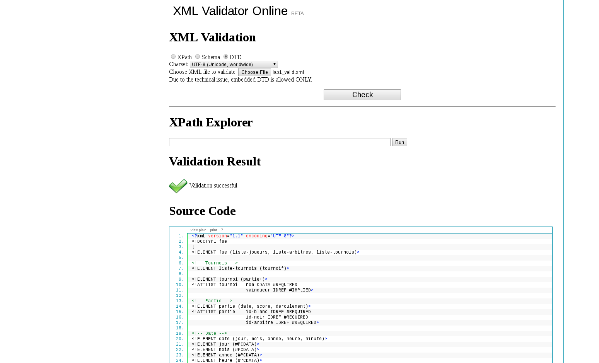

# SER Laboratoire 1

## Table des matières

- [Introduction](#introduction)
- [DTD](#dtd)
  - [Choix d'implémentation](#choix-dimplémentation)
  - [Code de la DTD](#code-de-la-dtd)
- [Exemple de document XML](#exemple-de-document-xml)
  - [Code du XML](#code-du-xml)
  - [Validation du XML](#validation-du-xml)
- [Questions](#questions)
- [Conclusion](#conclusion)

## Introduction

Dans ce laboratoire nous avons modélisé la structure d'un document XML soutenu par une définition de type de document (DTD). Le but de ce document est de pouvoir enregistrer toutes les parties qui ont été jouées dans le cadre de la FSE (Fédération Suisse d'Échecs) dans différents tournois.<br/>La structure du document doit répondre aux contraintes définies dans la donnée du problème mais il n'est pas demandé de connaître les règles du jeu. Nous avons tout de même essayé de respecter au mieux ces règles en nous basant sur notre propre connaissance du jeu.

## DTD

### Choix d'implémentation

### Code de la DTD

```dtd
<!ELEMENT fse (liste-joueurs, liste-arbitres, liste-tournois)>

<!-- Tournois -->
<!ELEMENT liste-tournois (tournoi*)>

<!ELEMENT tournoi (partie+)>
<!ATTLIST tournoi   nom CDATA #REQUIRED
                    vainqueur IDREF #IMPLIED>

<!-- Partie -->
<!ELEMENT partie (date, score, deroulement)>
<!ATTLIST partie    id-blanc IDREF #REQUIRED
                    id-noir IDREF #REQUIRED
                    id-arbitre IDREF #REQUIRED>

<!-- Date -->
<!ELEMENT date (jour, mois, annee, heure, minute)>
<!ELEMENT jour (#PCDATA)>
<!ELEMENT mois (#PCDATA)>
<!ELEMENT annee (#PCDATA)>
<!ELEMENT heure (#PCDATA)>
<!ELEMENT minute (#PCDATA)>

<!-- score -->
<!ELEMENT score EMPTY>
<!ATTLIST score resultat (1-0|0.5-0.5|0-1) #IMPLIED>

<!-- liste arbitre-->
<!ELEMENT liste-arbitres (arbitre*)>

<!-- arbitre -->
<!ELEMENT arbitre (nom, prenom)>
<!ATTLIST arbitre id-arbitre ID #REQUIRED>

<!ELEMENT nom (#PCDATA)>
<!ELEMENT prenom (#PCDATA)>

<!-- Liste des joueurs -->
<!ELEMENT liste-joueurs (joueur*)>

<!ELEMENT joueur (nom, prenom, elo)>
<!ATTLIST joueur id-fse ID #REQUIRED>
<!ELEMENT elo (#PCDATA)>

<!-- deroulement -->
<!ELEMENT deroulement (coup*)>

<!-- coup -->
<!ELEMENT coup ((roque|deplacement), situation?)>

<!ELEMENT situation EMPTY>
<!ATTLIST situation etat-partie (echec|echec-et-mat|partie-nulle) #REQUIRED>

<!ELEMENT roque EMPTY>
<!ATTLIST roque type (petit|grand) #REQUIRED>

<!ELEMENT deplacement (piece, depart?, arrivee, elimination?, promotion?)>

<!-- piece -->
<!ELEMENT piece EMPTY>
<!ATTLIST piece type (roi|pion|tour|cavalier|fou|dame) #REQUIRED>

<!ELEMENT piece-promotion EMPTY>
<!ATTLIST piece-promotion type (tour|cavalier|fou|dame) #REQUIRED>

<!ELEMENT elimination (piece)>

<!ELEMENT promotion (piece-promotion)>

<!ELEMENT depart (case)>
<!ELEMENT arrivee (case)>
<!ELEMENT case EMPTY>
<!ATTLIST case lettre (A|B|C|D|E|F|G|H) #REQUIRED
                chiffre (1|2|3|4|5|6|7|8) #REQUIRED>

```

## Exemple de document XML

### Code du XML

```XML
<?xml version="1.1" encoding="UTF-8"?>
<!DOCTYPE fse SYSTEM "contraintes.dtd">

<fse>
    <!-- Tous les joueurs -->
    <liste-joueurs>

        <joueur id-fse="j1">
            <nom>Gabin</nom>
            <prenom>Michel</prenom>
            <elo>2104</elo>
        </joueur>
        <joueur id-fse="j2">
            <nom>Proseco</nom>
            <prenom>Luigi</prenom>
            <elo>500</elo>
        </joueur>
        <joueur id-fse="j3">
            <nom>Zero</nom>
            <prenom>Alpha</prenom>
            <elo>3003</elo>
        </joueur>
        <joueur id-fse="j4">
            <nom>Vandamn</nom>
            <prenom>Jean-Claude</prenom>
            <elo>2105</elo>
        </joueur>
    </liste-joueurs>

    <!-- Tous les arbitres -->
    <liste-arbitres>

        <arbitre id-arbitre="a1">
            <nom>Meier</nom>
            <prenom>Urs</prenom>
        </arbitre>
        <arbitre id-arbitre="a2">
            <nom>Garcia</nom>
            <prenom>José</prenom>
        </arbitre>
    </liste-arbitres>

    <!-- Tous les tournois-->
    <liste-tournois>
        <!-- Tournoi 1 -->
        <tournoi nom="Tournoi du Léman">
            <!-- Partie 1 -->
            <partie id-blanc="j1" id-noir="j4" id-arbitre="a1">
                <date>
                    <jour>24</jour>
                    <mois>12</mois>
                    <annee>1948</annee>
                    <heure>15</heure>
                    <minute>30</minute>
                </date>
                <score resultat="1-0"/>
                <deroulement>
                    <coup>
                        <deplacement>
                            <piece type="pion" />
                            <arrivee>
                                <case lettre="D" chiffre="4" />
                            </arrivee>
                        </deplacement>
                    </coup>
                    <coup>
                        <deplacement>
                            <piece type="pion" />
                            <arrivee>
                                <case lettre="B" chiffre="6" />
                            </arrivee>
                        </deplacement>
                    </coup>
                    <coup>
                        <deplacement>
                            <piece type="pion" />
                            <arrivee>
                                <case lettre="E" chiffre="4" />
                            </arrivee>
                        </deplacement>
                    </coup>
                    <coup>
                        <deplacement>
                            <piece type="pion" />
                            <arrivee>
                                <case lettre="C" chiffre="5" />
                            </arrivee>
                        </deplacement>
                    </coup>
                    <coup>
                        <deplacement>
                            <piece type="pion" />
                            <arrivee>
                                <case lettre="C" chiffre="3" />
                            </arrivee>
                        </deplacement>
                    </coup>
                    <coup>
                        <deplacement>
                            <piece type="pion" />
                            <arrivee>
                                <case lettre="H" chiffre="5" />
                            </arrivee>
                        </deplacement>
                    </coup>
                    <coup>
                        <deplacement>
                            <piece type="pion" />
                            <arrivee>
                                <case lettre="G" chiffre="3" />
                            </arrivee>
                        </deplacement>
                    </coup>
                    <coup>
                        <deplacement>
                            <piece type="fou" />
                            <arrivee>
                                <case lettre="A" chiffre="6" />
                            </arrivee>
                        </deplacement>
                    </coup>
                    <coup>
                        <deplacement>
                            <piece type="fou" />
                            <arrivee>
                                <case lettre="G" chiffre="2" />
                            </arrivee>
                        </deplacement>
                    </coup>
                    <coup>
                        <deplacement>
                            <piece type="pion" />
                            <arrivee>
                                <case lettre="D" chiffre="4" />
                            </arrivee>
                            <elimination>
                                <piece type="pion" />
                            </elimination>
                        </deplacement>
                    </coup>
                    <coup>
                        <deplacement>
                            <piece type="pion" />
                            <arrivee>
                                <case lettre="E" chiffre="5" />
                            </arrivee>
                        </deplacement>
                    </coup>
                    <coup>
                        <deplacement>
                            <piece type="pion" />
                            <arrivee>
                                <case lettre="D" chiffre="6" />
                            </arrivee>
                        </deplacement>
                    </coup>
                    <coup>
                        <deplacement>
                            <piece type="fou" />
                            <arrivee>
                                <case lettre="A" chiffre="8" />
                            </arrivee>
                            <elimination>
                                <piece type="tour" />
                            </elimination>
                        </deplacement>
                    </coup>
                    <coup>
                        <deplacement>
                            <piece type="dame" />
                            <arrivee>
                                <case lettre="C" chiffre="7" />
                            </arrivee>
                        </deplacement>
                    </coup>
                    <coup>
                        <deplacement>
                            <piece type="cavalier" />
                            <arrivee>
                                <case lettre="E" chiffre="2" />
                            </arrivee>
                        </deplacement>
                    </coup>
                    <coup>
                        <deplacement>
                            <piece type="fou" />
                            <arrivee>
                                <case lettre="E" chiffre="2" />
                            </arrivee>
                            <elimination>
                                <piece type="cavalier" />
                            </elimination>
                        </deplacement>
                    </coup>
                    <coup>
                        <deplacement>
                            <piece type="dame" />
                            <arrivee>
                                <case lettre="E" chiffre="2" />
                            </arrivee>
                            <elimination>
                                <piece type="fou" />
                            </elimination>
                        </deplacement>
                    </coup>
                    <coup>
                        <deplacement>
                            <piece type="pion" />
                            <arrivee>
                                <case lettre="C" chiffre="3" />
                            </arrivee>
                        </deplacement>
                    </coup>
                    <coup>
                        <deplacement>
                            <piece type="pion" />
                            <arrivee>
                                <case lettre="C" chiffre="3" />
                            </arrivee>
                            <elimination>
                                <piece type="pion" />
                            </elimination>
                        </deplacement>
                    </coup>
                    <coup>
                        <deplacement>
                            <piece type="pion" />
                            <arrivee>
                                <case lettre="D" chiffre="5" />
                            </arrivee>
                        </deplacement>
                    </coup>
                    <coup>
                        <roque type="petit" />
                    </coup>
                    <coup>
                        <deplacement>
                            <piece type="dame" />
                            <arrivee>
                                <case lettre="C" chiffre="5" />
                            </arrivee>
                        </deplacement>
                    </coup>
                    <coup>
                        <deplacement>
                            <piece type="fou" />
                            <arrivee>
                                <case lettre="F" chiffre="4" />
                            </arrivee>
                        </deplacement>
                    </coup>
                    <coup>
                        <deplacement>
                            <piece type="cavalier" />
                            <arrivee>
                                <case lettre="D" chiffre="7" />
                            </arrivee>
                        </deplacement>
                    </coup>
                    <coup>
                        <deplacement>
                            <piece type="pion" />
                            <arrivee>
                                <case lettre="A" chiffre="4" />
                            </arrivee>
                        </deplacement>
                    </coup>
                    <coup>
                        <deplacement>
                            <piece type="dame" />
                            <arrivee>
                                <case lettre="C" chiffre="4" />
                            </arrivee>
                        </deplacement>
                    </coup>
                    <coup>
                        <deplacement>
                            <piece type="dame" />
                            <arrivee>
                                <case lettre="D" chiffre="1" />
                            </arrivee>
                        </deplacement>
                    </coup>
                    <coup>
                        <deplacement>
                            <piece type="cavalier" />
                            <depart>
                                <case lettre="G" chiffre="8" />
                            </depart>
                            <arrivee>
                                <case lettre="F" chiffre="6" />
                            </arrivee>
                        </deplacement>
                    </coup>
                    <coup>
                        <deplacement>
                            <piece type="pion" />
                            <arrivee>
                                <case lettre="A" chiffre="5" />
                            </arrivee>
                        </deplacement>
                    </coup>
                    <coup>
                        <deplacement>
                            <piece type="pion" />
                            <arrivee>
                                <case lettre="G" chiffre="5" />
                            </arrivee>
                        </deplacement>
                    </coup>
                    <coup>
                        <deplacement>
                            <piece type="fou" />
                            <arrivee>
                                <case lettre="G" chiffre="5" />
                            </arrivee>
                            <elimination>
                                <piece type="pion" />
                            </elimination>
                        </deplacement>
                    </coup>
                    <coup>
                        <deplacement>
                            <piece type="cavalier" />
                            <arrivee>
                                <case lettre="G" chiffre="8" />
                            </arrivee>
                        </deplacement>
                    </coup>
                    <coup>
                        <deplacement>
                            <piece type="pion" />
                            <arrivee>
                                <case lettre="A" chiffre="6" />
                            </arrivee>
                        </deplacement>
                    </coup>
                    <coup>
                        <deplacement>
                            <piece type="pion" />
                            <arrivee>
                                <case lettre="D" chiffre="4" />
                            </arrivee>
                        </deplacement>
                    </coup>
                    <coup>
                        <deplacement>
                            <piece type="pion" />
                            <arrivee>
                                <case lettre="D" chiffre="7" />
                            </arrivee>
                            <elimination>
                                <piece type="cavalier" />
                            </elimination>
                        </deplacement>
                    </coup>
                    <coup>
                        <deplacement>
                            <piece type="roi" />
                            <arrivee>
                                <case lettre="D" chiffre="8" />
                            </arrivee>
                        </deplacement>
                    </coup>
                    <coup>
                        <deplacement>
                            <piece type="dame" />
                            <arrivee>
                                <case lettre="F" chiffre="3" />
                            </arrivee>
                        </deplacement>
                    </coup>
                    <coup>
                        <deplacement>
                            <piece type="roi" />
                            <arrivee>
                                <case lettre="D" chiffre="7" />
                            </arrivee>
                            <elimination>
                                <piece type="pion" />
                            </elimination>
                        </deplacement>
                    </coup>
                    <coup>
                        <deplacement>
                            <piece type="dame" />
                            <arrivee>
                                <case lettre="B" chiffre="7" />
                            </arrivee>
                        </deplacement>
                        <situation etat-partie="echec" />
                    </coup>
                    <coup>
                        <deplacement>
                            <piece type="dame" />
                            <arrivee>
                                <case lettre="C" chiffre="7" />
                            </arrivee>
                        </deplacement>
                    </coup>
                    <coup>
                        <deplacement>
                            <piece type="dame" />
                            <arrivee>
                                <case lettre="D" chiffre="5" />
                            </arrivee>
                        </deplacement>
                        <situation etat-partie="echec" />
                    </coup>
                    <coup>
                        <deplacement>
                            <piece type="roi" />
                            <arrivee>
                                <case lettre="E" chiffre="8" />
                            </arrivee>
                        </deplacement>
                    </coup>
                    <coup>
                        <deplacement>
                            <piece type="pion" />
                            <arrivee>
                                <case lettre="B" chiffre="6" />
                            </arrivee>
                            <elimination>
                                <piece type="pion" />
                            </elimination>
                        </deplacement>
                    </coup>
                    <coup>
                        <deplacement>
                            <piece type="pion" />
                            <arrivee>
                                <case lettre="F" chiffre="6" />
                            </arrivee>
                        </deplacement>
                    </coup>
                    <coup>
                        <deplacement>
                            <piece type="pion" />
                            <arrivee>
                                <case lettre="C" chiffre="7" />
                            </arrivee>
                            <elimination>
                                <piece type="dame" />
                            </elimination>
                        </deplacement>
                    </coup>
                    <coup>
                        <deplacement>
                            <piece type="pion" />
                            <arrivee>
                                <case lettre="F" chiffre="5" />
                            </arrivee>
                        </deplacement>
                    </coup>
                    <coup>
                        <deplacement>
                            <piece type="tour" />
                            <arrivee>
                                <case lettre="A" chiffre="7" />
                            </arrivee>
                            <elimination>
                                <piece type="pion" />
                            </elimination>
                        </deplacement>
                    </coup>
                    <coup>
                        <deplacement>
                            <piece type="pion" />
                            <arrivee>
                                <case lettre="C" chiffre="8" />
                            </arrivee>
                            <promotion>
                                <piece-promotion type="dame" />
                            </promotion>
                        </deplacement>
                        <situation etat-partie="echec-et-mat" />
                    </coup>
                </deroulement>
            </partie>
            <!-- Partie 2-->
            <partie id-blanc="j2" id-noir="j3" id-arbitre="a1">
                <date>
                    <jour>24</jour>
                    <mois>12</mois>
                    <annee>1948</annee>
                    <heure>16</heure>
                    <minute>30</minute>
                </date>
                <score resultat="0-1"/>
                <deroulement>
                    <coup>
                        <deplacement>
                            <piece type="pion" />
                            <arrivee>
                                <case lettre="E" chiffre="4" />
                            </arrivee>
                        </deplacement>
                    </coup>
                    <coup>
                        <deplacement>
                            <piece type="pion" />
                            <arrivee>
                                <case lettre="C" chiffre="5" />
                            </arrivee>
                        </deplacement>
                    </coup>
                    <coup>
                        <deplacement>
                            <piece type="roi" />
                            <arrivee>
                                <case lettre="E" chiffre="2" />
                            </arrivee>
                        </deplacement>
                    </coup>
                    <coup>
                        <deplacement>
                            <piece type="cavalier" />
                            <arrivee>
                                <case lettre="C" chiffre="6" />
                            </arrivee>
                        </deplacement>
                    </coup>
                    <coup>
                        <deplacement>
                            <piece type="roi" />
                            <arrivee>
                                <case lettre="E" chiffre="3" />
                            </arrivee>
                        </deplacement>
                    </coup>
                    <coup>
                        <deplacement>
                            <piece type="pion" />
                            <arrivee>
                                <case lettre="D" chiffre="5" />
                            </arrivee>
                        </deplacement>
                    </coup>
                    <coup>
                        <deplacement>
                            <piece type="pion" />
                            <arrivee>
                                <case lettre="D" chiffre="5" />
                            </arrivee>
                            <elimination>
                                <piece type="pion" />
                            </elimination>
                        </deplacement>
                    </coup>
                    <coup>
                        <deplacement>
                            <piece type="dame" />
                            <arrivee>
                                <case lettre="D" chiffre="5" />
                            </arrivee>
                            <elimination>
                                <piece type="pion" />
                            </elimination>
                        </deplacement>
                    </coup>
                    <coup>
                        <deplacement>
                            <piece type="roi" />
                            <arrivee>
                                <case lettre="F" chiffre="4" />
                            </arrivee>
                        </deplacement>
                    </coup>
                    <coup>
                        <deplacement>
                            <piece type="dame" />
                            <arrivee>
                                <case lettre="E" chiffre="5" />
                            </arrivee>
                        </deplacement>
                        <situation etat-partie="echec" />
                    </coup>
                    <coup>
                        <deplacement>
                            <piece type="roi" />
                            <arrivee>
                                <case lettre="F" chiffre="3" />
                            </arrivee>
                        </deplacement>
                    </coup>
                    <coup>
                        <deplacement>
                            <piece type="cavalier" />
                            <arrivee>
                                <case lettre="D" chiffre="4" />
                            </arrivee>
                        </deplacement>
                        <situation etat-partie="echec-et-mat" />
                    </coup>
                </deroulement>
            </partie>
        </tournoi>

        <!-- Tournoi 2 -->
        <tournoi nom="Tournoi de Payerne">
            <!-- Partie 3 -->
            <partie id-blanc="j2" id-noir="j3" id-arbitre="a2">
                <date>
                    <jour>1</jour>
                    <mois>2</mois>
                    <annee>2003</annee>
                    <heure>9</heure>
                    <minute>10</minute>
                </date>
                <score resultat="1-0" />
                <deroulement>
                    <coup>
                        <deplacement>
                            <piece type="pion" />
                            <arrivee>
                                <case lettre="E" chiffre="4" />
                            </arrivee>
                        </deplacement>
                    </coup>
                    <coup>
                        <deplacement>
                            <piece type="pion" />
                            <arrivee>
                                <case lettre="E" chiffre="5" />
                            </arrivee>
                        </deplacement>
                    </coup>
                    <coup>
                        <deplacement>
                            <piece type="dame" />
                            <arrivee>
                                <case lettre="H" chiffre="5" />
                            </arrivee>
                        </deplacement>
                    </coup>
                    <coup>
                        <deplacement>
                            <piece type="cavalier" />
                            <arrivee>
                                <case lettre="C" chiffre="6" />
                            </arrivee>
                        </deplacement>
                    </coup>
                    <coup>
                        <deplacement>
                            <piece type="fou" />
                            <arrivee>
                                <case lettre="C" chiffre="4" />
                            </arrivee>
                        </deplacement>
                    </coup>
                    <coup>
                        <deplacement>
                            <piece type="cavalier" />
                            <arrivee>
                                <case lettre="F" chiffre="6" />
                            </arrivee>
                        </deplacement>
                    </coup>
                    <coup>
                        <deplacement>
                            <piece type="dame" />
                            <arrivee>
                                <case lettre="F" chiffre="7" />
                            </arrivee>
                            <elimination>
                                <piece type="pion" />
                            </elimination>
                        </deplacement>
                        <situation etat-partie="echec-et-mat" />
                    </coup>
                </deroulement>
            </partie>
            <!-- Partie 4 -->
            <partie id-blanc="j1" id-noir="j4" id-arbitre="a2">
                <date>
                    <jour>1</jour>
                    <mois>2</mois>
                    <annee>2003</annee>
                    <heure>9</heure>
                    <minute>50</minute>
                </date>
                <score resultat="0-1"/>
                <deroulement>
                    <coup>
                        <deplacement>
                            <piece type="pion" />
                            <arrivee>
                                <case lettre="F" chiffre="4" />
                            </arrivee>
                        </deplacement>
                    </coup>
                    <coup>
                        <deplacement>
                            <piece type="pion" />
                            <arrivee>
                                <case lettre="E" chiffre="5" />
                            </arrivee>
                        </deplacement>
                    </coup>
                    <coup>
                        <deplacement>
                            <piece type="roi" />
                            <arrivee>
                                <case lettre="F" chiffre="2" />
                            </arrivee>
                        </deplacement>
                    </coup>
                    <coup>
                        <deplacement>
                            <piece type="pion" />
                            <arrivee>
                                <case lettre="D" chiffre="5" />
                            </arrivee>
                        </deplacement>
                    </coup>
                    <coup>
                        <deplacement>
                            <piece type="dame" />
                            <arrivee>
                                <case lettre="E" chiffre="1" />
                            </arrivee>
                        </deplacement>
                    </coup>
                    <coup>
                        <deplacement>
                            <piece type="cavalier" />
                            <arrivee>
                                <case lettre="C" chiffre="6" />
                            </arrivee>
                        </deplacement>
                    </coup>
                    <coup>
                        <deplacement>
                            <piece type="pion" />
                            <arrivee>
                                <case lettre="F" chiffre="4" />
                            </arrivee>
                        </deplacement>
                    </coup>
                    <coup>
                        <deplacement>
                            <piece type="pion" />
                            <arrivee>
                                <case lettre="F" chiffre="4" />
                            </arrivee>
                            <elimination>
                                <piece type="pion" />
                            </elimination>
                        </deplacement>
                    </coup>
                    <coup>
                        <deplacement>
                            <piece type="pion" />
                            <arrivee>
                                <case lettre="A" chiffre="3" />
                            </arrivee>
                        </deplacement>
                    </coup>
                    <coup>
                        <deplacement>
                            <piece type="cavalier" />
                            <arrivee>
                                <case lettre="D" chiffre="4" />
                            </arrivee>
                        </deplacement>
                    </coup>
                    <coup>
                        <deplacement>
                            <piece type="tour" />
                            <arrivee>
                                <case lettre="A" chiffre="2" />
                            </arrivee>
                        </deplacement>
                    </coup>
                    <coup>
                        <deplacement>
                            <piece type="cavalier" />
                            <arrivee>
                                <case lettre="F" chiffre="6" />
                            </arrivee>
                        </deplacement>
                    </coup>
                    <coup>
                        <deplacement>
                            <piece type="pion" />
                            <arrivee>
                                <case lettre="D" chiffre="3" />
                            </arrivee>
                        </deplacement>
                    </coup>
                    <coup>
                        <deplacement>
                            <piece type="cavalier" />
                            <arrivee>
                                <case lettre="G" chiffre="3" />
                            </arrivee>
                        </deplacement>
                        <situation etat-partie="echec-et-mat" />
                    </coup>
                </deroulement>
            </partie>
        </tournoi>
    </liste-tournois>
</fse>
```

### Validation du XML



Pour valider notre document nous avons créé un fichier <i>lab1_valid.xml</i> qui n'est rien d'autre que notre fichier XML qui intègre directement sa DTD et nous l'avons passé dans le validateur de <http://xmlvalidator.new-studio.org/> qui support le XML 1.1.

## Questions

- <i>Imaginons que vous souhaitez enregistrer le classement ELO que chaque joueur
d’une partie avait au moment où elle a été jouée, qu’est-ce qu’il faudrait modifier
dans votre DTD ?</i><br/><br/>

- <i>Est-ce possible dans votre DTD de représenter le fait qu’il ne peut y avoir que 20
parties au maximum dans un tournoi ? Si oui, comment ?</i><br/><br/>

- <i>Est-ce possible dans votre DTD de représenter le fait que les 2 joueurs d’une partie
doivent être différents ? Si oui, comment ?</i><br/><br/>

## Conclusion